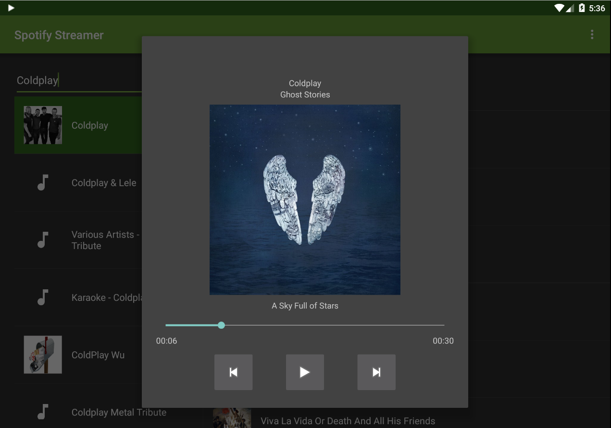
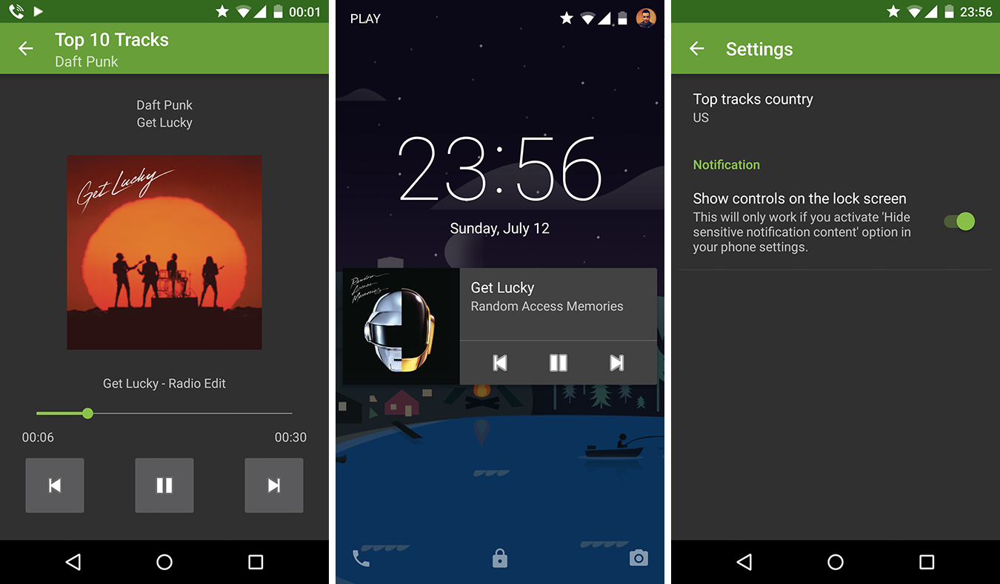

# nanodegree_spotify_streamer_stage2
Second stage of the Spotify Streamer project.

## Author
[Ferran Negre Pizarro](https://profiles.udacity.com/u/ferrannegre)

## Screenshots

## Comments to the reviewer
- Used [NotificationCompat.MediaStyle](https://developer.android.com/reference/android/support/v7/app/NotificationCompat.MediaStyle.html)
  and [MediaSessionCompat](https://developer.android.com/reference/android/support/v4/media/session/MediaSessionCompat.html)
  to show a notification that allows the user to control the player
- Notification media control are usable on the lockscreen too (for Lollipop). This can be changed in the app Settings
- Using a Service for playing the samples (this service is stopped when user dismiss the notification)
- Used [Layout Aliases](http://developer.android.com/training/multiscreen/screensizes.html#TaskUseAliasFilters) to create an special layout for phone in landscape mode